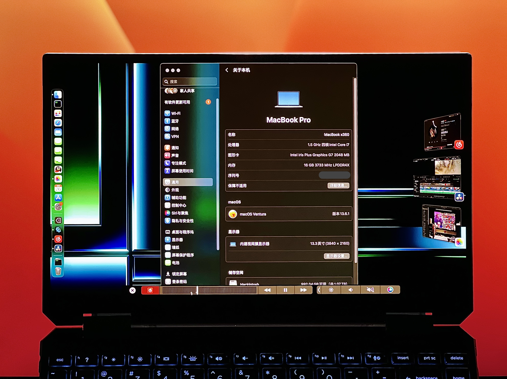
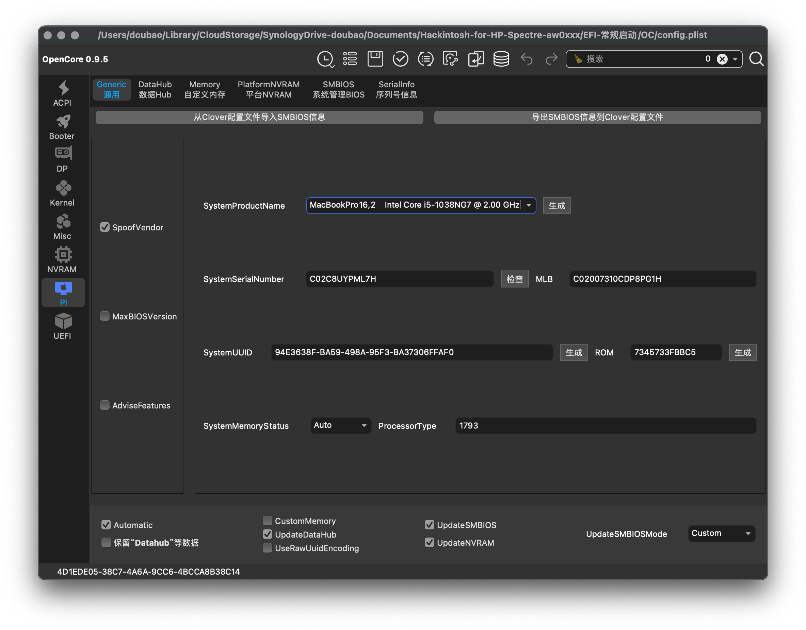
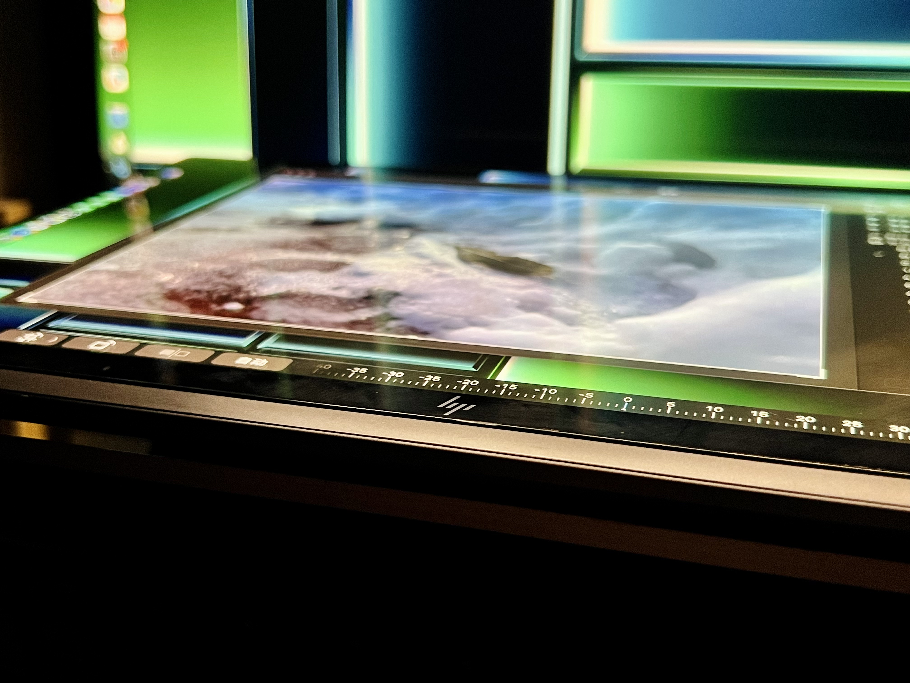
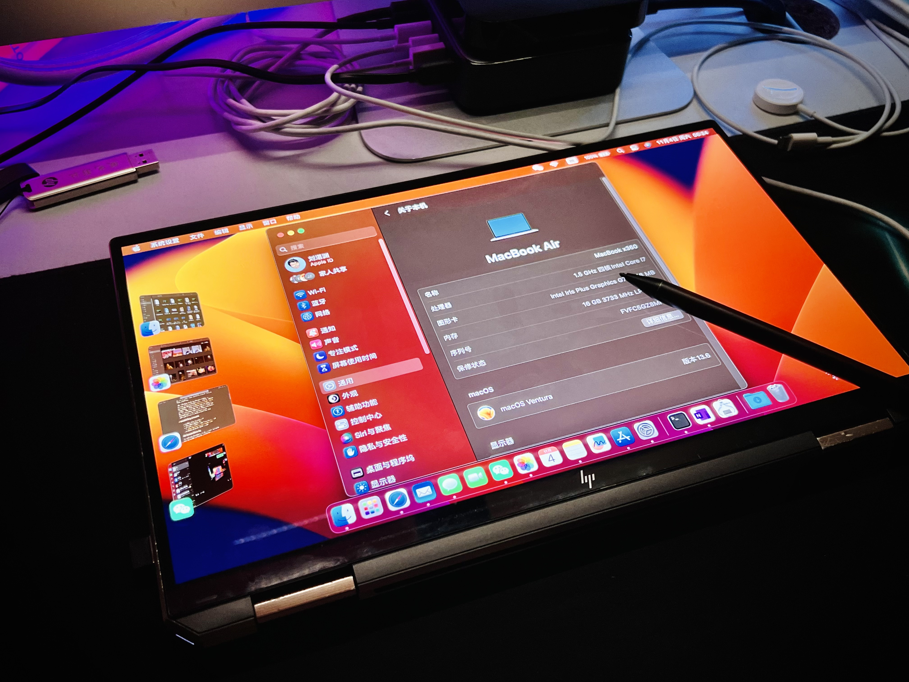

# 幽灵 aw0xxx 的黑苹果配置

[English](./README-en.md)

一套差强人意的 EFI，只能保证勉强堪用。
欢迎提交，欢迎大佬指点，这些问题我真的不太会修。。。

[TOC]

## 💻硬件

| 设备       | 型号                            | 状态   | 备注 |
| ---------- | ------------------------------- | ------ | ---------- |
| 笔记本电脑 | 惠普 幽灵 x360 13 aw0xxx | ✔ | macOS 13.6.1 Ventura |
| 处理器 | 英特尔 酷睿 i7-1065G7 | ✔ |  |
| 核芯显卡 | 英特尔 锐炬 Plus Graphics | ✔ |  |
| 外置显卡 | 讯景 RX 5700XT | ✔ | （雷电显卡坞）可以识别并调用，但频率和功耗无法调节，始终接近空载状态 |
| 内存 | 美光 LPDDR4X 3733MHz 8GB × 2 | ✔ |  |
| 外存 | 光威 NVMe 2TB | ✔ |  |
| 显示器 | 三星 AMOLED 4K | ✔ | 光标显示异常；亮度无法 DDC 调节（用BetterDisplay 等软件缓解） |
| 声卡 | 瑞昱 ALC285 | ✔ | 扬声器和耳机会同时出现在输出设备中，不影响自动切换；四扬声器中，只有远端两个扬声器出声 |
| 麦克风  | 英特尔智音技术 | ❌ |  |
| 摄像头 | 惠普 True Vision 高清相机 | ✔ |  |
| 红外摄像头 | 惠普红外相机 | ❌ |  |
| 指纹识别 | 新思 UWP WBDI | ❌ |  |
| WiFi 和蓝牙 | 英特尔 AX201 | ✔ | 部分蓝牙鼠标可能会抽风，其余设备暂未发现异常 |
| 键盘 |  | ✔ | 静音时静音键指示灯不亮，功能无影响；Fn 键仅用作键盘控制，不会输入到任何系统内，决不是 macOS 的软 Fn 键 |
| 触控板 | 新思 3297 | ❌ | 奇怪，研究中…… |
| 触摸屏 | ELAN EzTouchFilter 2514&Col1 | ✔ | 支持 APIC 中断，支持十点触控与手势，功能暂可替代触控板 |
| 笔 | ELAN EzTouchFilter 2514&Col6 | ❌ | Windows 及 Linux 下支持所有 MPP 2.0 协议笔，所有笔都无法在 macOS 下工作 |
| USB-A 5Gb/s |  | ✔ |  |
| USB-C 10Gb/s |  | ✔ |  |
| 雷电 3 | 雷电控制器 8A17 | ❌ | 连接的部分设备可分别被识别，但无雷电总线，也不可热插拔（需要冷启动）；雷电网桥不可用 |
| 读卡器 | 瑞昱 SDXC UHS-I | ✔ |  |
| 各主要元件传感器 |  | ✔ | 温控正常，参数可读 |

## 💿软件

| 功能 | 状态 | 备注 |
| --- | --- | --- |
| 处理器睿频、变频 | ✔ |  |
| 显卡硬件加速 | ✔ | 无法硬件解码视频（播放时 CPU 软解） |
| iCloud、iMessage、FaceTime | ✔ | FaceTime 拨出会崩溃 |
| 连续互通（隔空投送、接力、通用控制、通用剪贴板、无线随航、隔空播放接收器、连续互通相机、Apple Watch 解锁等） | ❌ | Airportltwm 限制 |
| 查找 | ❌ | 无法在「查找」应用内广播位置、播放声音 |
| 电池电量 | ✔ |  |
| 触控栏（虚拟） | ✔ | SMBIOS 为 MacBook Pro 16,2 时，可以正常在「系统设置」内自定义 |
| 睡眠 | ❌ | 熄屏后短时间可唤醒，但敲击键盘到唤醒之间时间较长 |
| 休眠 | ❌ |  |
| 从本机 EFI 引导启动 macOS | ❌ | 本机 EFI 引导启动非 macOS 无问题，USB EFI 引导启动无问题 |
| 屏幕自动旋转 | ❌ | 绑定快捷键手动旋转 |

## 🧭安装说明

请确保你拥有：

- 不小于 16GB 的 U 盘 / 移动硬盘，用于安装、引导 macOS（最好支持 USB 3.0 或更快速率，不然会很慢）
- OpenCore Auxiliary Tool，用于傻瓜式配置 EFI
- 良好的网络连接，用于下载 macOS 安装镜像及本仓库
- 充裕的时间、良好的耐心

### 准备

1. 参照 [OpenCore 官方教程](https://dortania.github.io/OpenCore-Install-Guide/)制作 macOS 安装介质，并挂载其 EFI 分区；
2. 参照上述教程，把机器 BIOS 里面选项该关的关了，找不到的不用管；
3. 参照上述教程（对，建议通读一遍再来抄作业），使用 OpenCore Auxiliary Tool 打开 `EFI-安装/*/OC/config.plist`，将惠普选项选对，保存；

### 安装

1. 删除安装介质原有的 `EFI` 目录，将 `EFI-安装` 目录下的 `1. YOGA C940-14 EFI 4 Ventura 13.3 安装` 拷贝到安装介质的 EFI 分区，并将其重命名为 `EFI`；
2. 将机器关机，插入安装介质，开机选择从安装介质启动，将 macOS 安装到本机硬盘；
3. 此时机器需要重启数次以继续安装，选择从本机硬盘启动时将崩溃，待其关机后拔下安装介质；
4. 删除安装介质原有的 `EFI` 目录，将 `EFI-安装` 目录下的 `3. YOGA C940-14 EFI 4 Ventura 13.3 使用` 拷贝到安装介质的 EFI 分区，并将其重命名为 `EFI`；
5. 插入安装介质，开机选择从本机硬盘启动，完成 macOS 的安装，成功后应该能登录进入桌面，此时**暂不要**登录 Apple ID；

### 善后

1. 删除安装介质原有的 `EFI` 目录，将 `EFI-启动` 拷贝到安装介质的 EFI 分区，并将其重命名为 `EFI`；
2. 用 OpenCore Auxiliary Tools 或其它工具打开安装介质 EFI 分区内的 `EFI/OC/config.plist`，随机生成自己的序列号、UUID、MLB、ROM，若在苹果官网检查未报错则能顺利开启 iMessage、FaceTime 等服务，完成后保存。⚠️不要套用现有的码，本仓库提供的也是随机生成且未经验证，盲目使用有 Apple ID 相关的一系列风险！
3. 重启机器，登录 Apple ID，尽情使用吧～

## 🧾开发计划

- [ ] 修复触控板
- [ ] 修复笔
- [ ] 加入翻转二合一形态检测，以自动禁用键盘触控板
- [ ] 修复光标显示问题
- [ ] 修复外置显卡调度
- [ ] ……（不太想修的所有其它）

## 🙏致谢

- **核显**：因为本人配置 EFI 时屡屡碰壁，查遍中外资料，柳暗花明拜读到 [@一直幸运一直作死 的《榨干联想 C940 的所有可玩性 macOS 黑苹果 + ChromeOS 安装记录》](https://zhuanlan.zhihu.com/p/620424062)，套用该核显调度方案才成功安装，最终的 EFI 也基于此修改而来。本人十分佩服大佬驯服 Icelake 处理器的精妙技术，遂斗胆把三个 EFI 放进仓库，以帮助更多人并提醒自己不断学习，再次感谢大佬的无私公开！

## 📸图集

